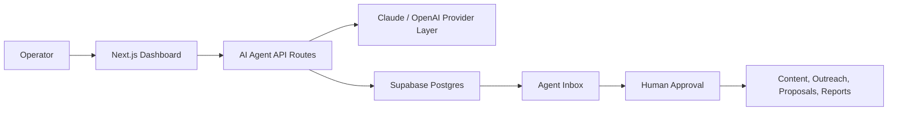

# Marketing AI System

Multi-agent marketing operations desk for founders and small teams: strategy, research, content, outreach, proposals, and weekly reporting in one approval-driven workspace.

## Problem

Small teams often run marketing from disconnected notes, spreadsheets, chat prompts, and CRM tabs. The work is repetitive, but still risky because outbound messages, proposals, and public content need human judgment before they go live. This creates a slow loop between product positioning, lead research, content creation, outreach, and reporting.

## Solution

Marketing AI System centralizes the marketing workflow into a dashboard powered by specialized AI agents. Each agent handles a focused job, writes structured output, and sends the result to a shared inbox where the operator can approve, edit, reject, or turn it into the next action.

The product is designed around a simple rule: AI can prepare the work, but a human approves anything customer-facing.

## What It Includes

- Product and offer workspace for positioning, pricing, objections, buyer pains, and landing page copy
- Lead CRM with prioritization, research notes, follow-up dates, and pipeline status
- Agent inbox for reviewing AI recommendations before anything is sent or published
- Content system for LinkedIn posts, carousel outlines, one-pagers, and campaign assets
- Outreach system for email sequences, LinkedIn messages, follow-ups, and reply handling
- Proposal builder with executive summaries, scope, pricing, next steps, and cover emails
- Weekly marketing report with activity metrics, blockers, best-performing messages, and next actions

## Agent System

The app models a marketing department as a set of focused agents:

- Product Strategy Agent
- ICP and Market Research Agent
- Landing Page Agent
- Content Agent
- Carousel / One-Pager Agent
- Lead Research Agent
- Outreach Agent
- Reply Handler Agent
- Follow-Up Agent
- Proposal Agent
- Meeting Prep Agent
- Weekly CEO Report Agent

Each agent has a narrow responsibility, a typed output target, and a review path through the agent inbox.

## Architecture



## Key Design Decisions

- **Human-in-the-loop by default:** the system drafts and recommends, but customer-facing actions stay in a review queue.
- **Specialized agents instead of one generic chatbot:** each workflow has its own prompt, data shape, and business context.
- **Structured JSON outputs:** agent results are easier to validate, store, display, and turn into follow-up actions.
- **Central approval inbox:** the operator does not need to check every tool or page to know what needs attention.
- **Supabase-backed workflow state:** leads, products, proposals, content, tasks, agent messages, and reports share one data model.
- **Provider abstraction:** Claude is the primary provider, with room for OpenAI or other models as fallback.
- **Portfolio-safe demo data:** included sample records are synthetic and designed to show product behavior without exposing client data.

## Tech Stack

- **Frontend:** Next.js App Router, React, TypeScript
- **Styling:** Tailwind CSS, lucide-react icons
- **Backend:** Next.js API routes
- **Database:** Supabase Postgres
- **AI:** Anthropic Claude SDK, optional OpenAI-compatible provider path
- **Exports:** jsPDF and JSZip for document/content packaging
- **Deployment target:** Vercel

## Repository Safety

This public version excludes local environments, build output, dependency folders, Supabase temp files, and private data. Environment variables are documented in `.env.local.example` with placeholder values only.

## Run Locally

```bash
npm install
cp .env.local.example .env.local
npm run dev
```

Then open `http://localhost:3000`.

For a full Supabase-backed setup, create a Supabase project, add the environment variables from `.env.local.example`, and apply the SQL migrations in `supabase/migrations`.

## Environment Variables

```bash
NEXT_PUBLIC_SUPABASE_URL=
NEXT_PUBLIC_SUPABASE_ANON_KEY=
SUPABASE_SERVICE_ROLE_KEY=
ANTHROPIC_API_KEY=
OPENAI_API_KEY=
GEMINI_API_KEY=
NEXT_PUBLIC_APP_URL=
GOOGLE_API_KEY=
GOOGLE_SEARCH_CX=
GOOGLE_SERVICE_ACCOUNT_JSON=
```

## Portfolio Notes

This project demonstrates how I think about AI product systems beyond a simple chat interface: workflow design, approval states, structured agent outputs, CRM-style data modeling, and operator control. The focus is not just generating text, but making AI useful inside a real marketing operating system.
