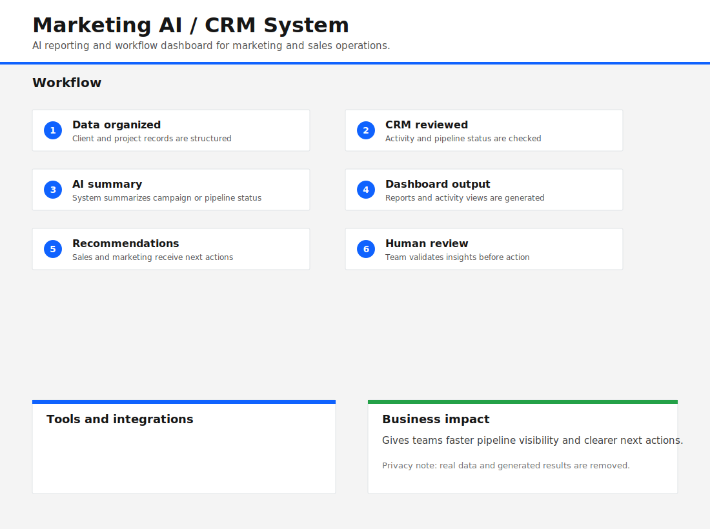

# Marketing AI / CRM System

AI-powered marketing and CRM workspace for organizing leads, projects, content, proposals, reports, and agent-assisted workflows.

## Problem

Marketing and sales teams often work across disconnected CRM records, campaign notes, proposal drafts, and reporting spreadsheets. Without automation, managers spend too much time assembling status updates and next actions manually. Any public portfolio version must remove real pipeline, client, calendar, and proposal results.

## Solution

This repository presents a portfolio-safe Next.js system that demonstrates AI-assisted CRM and marketing operations. The app structure includes dashboards, agents, workflows, content, proposals, and reporting while replacing real mock outputs with empty dummy-safe placeholders.

## Workflow Infographic

## System Architecture

- Next.js application with dashboard pages and API routes.
- Supabase-ready database schema and migrations.
- AI provider adapters for OpenAI, Anthropic, Gemini, and GPT image generation.
- Agent workflow modules for lead research, outreach, content, proposals, weekly operations, and reporting.
- Human review screens for approving or editing AI outputs.

## Tools Used

Salesforce-style CRM concepts, dashboards, AI reporting, automation workflows, Supabase, Next.js, OpenAI, Anthropic, Gemini, and image generation providers.

## Key Features

- CRM-style lead and project organization.
- Agent-assisted campaign and pipeline summaries.
- Dashboard/reporting structure.
- Proposal, outreach, and content workflow modules.
- Provider routing for multiple AI APIs.
- Portfolio-safe mock data with real results removed.

## Example Workflow

1. Organize dummy client and project data.
2. Review CRM activity and pipeline status.
3. Run an AI agent to summarize progress.
4. Review dashboard or reporting output.
5. Approve recommendations before action.

## Business Impact

The system demonstrates how AI agents can support marketing operations by reducing manual reporting, improving follow-up visibility, and creating a shared workspace for campaign decisions. It is structured to show practical engineering and business process thinking while keeping all sensitive results out of the public repository.

## Security & Data Privacy

This repository is a portfolio-safe version of the system. All real client data, API keys, tender documents, CRM exports, generated proposals, calendar outputs, and operational results have been removed. Any files shown are empty placeholders or dummy samples created only to demonstrate the workflow structure.

## How to Run Locally

1. Copy `.env.example` to `.env.local` and add your own local credentials.
2. Run `npm install`.
3. Run `npm run dev`.
4. Open the local Next.js URL and use only dummy data.

## Future Improvements

- Add demo seed data that is clearly fake.
- Add role-based permissions.
- Add exportable portfolio demo reports with dummy metrics only.
